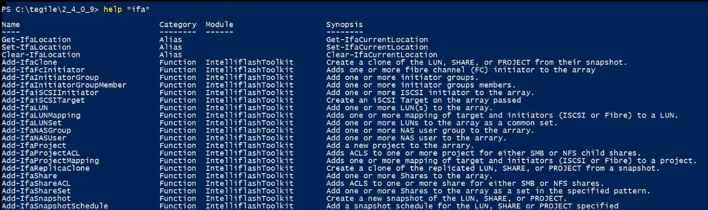
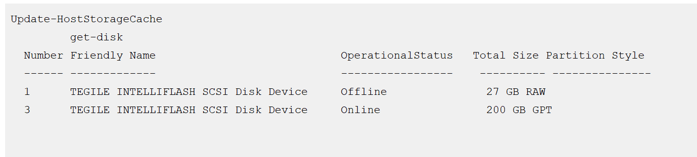
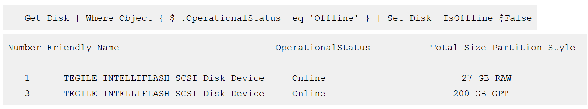
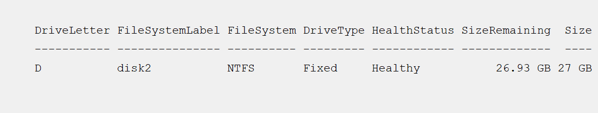
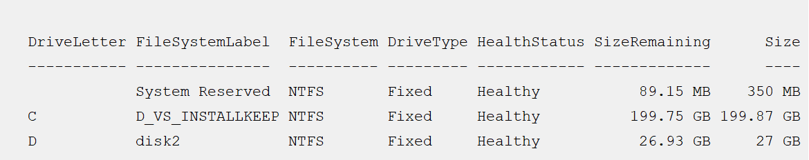

# PowerShell ToolKit Overview

The Toolkit conforms to standards and provides intuitive script management of the storage array.

Administrators can download this scripted module of cmdlets from the IntelliFlash Web UI. Each cmdlet function is prefixed with "-Ifa". The Toolkit provides sample code for users to do their own scripting, and allows administrators to do most of what the IntelliFlash Web UI does through Windows . Powershell script primarily calls the IntelliFlash REST APIs. You can perform create-delete-modify-enumerate operations on LUNs, shares, projects, snapshots, initiators, and targets within the ecosystem.

# Minimum Requirements

Make sure that the following pre-requisites are met before installing the PowerShell ToolKit:

- Windows System Requirement:
    - Windows 10 and above (32-bit or 64-bit) or Windows Server 2016 and higher versions.
- PowerShell:
    - Microsoft Powershell 7.0 and above.
- Microsoft .NET Framework:
    - Microsoft .NET Framework 4.62 and above.
- Powershell ToolKit connects to an array with TLS 1.2 from a Windows TLS 1.2 capable host machine.
- REST API requirements:
    - ToolKit connects to array's Web API 2.1 through 2.4 without error.
    - Toolkit connects to the array's Web API beyond 2.4 with a warning.

**Note**: Powershell Toolkit can connect to arrays that have Web API 1.0 with a compatibility parameter override. However, it has not been certified or thoroughly tested.

# Downloading and Installing PowerShell Toolkit

Perform the following actions to install the PowerShell ToolKit:

1. From the IntelliFlash Web UI, go to **Settings > Administrator > Plugins**.
2. Click **Download** to download the **PowerShell Toolkit setup.exe** file for 32-bit or 64-bit system.
3. Run the IntelliFlashPowershellToolkitSetupX86 or IntelliFlashPowershellToolkitSetupX64 file, depending on your platform.
4. Follow the instructions on the PowerShell Installation wizard to complete the installation.

**Note**: The IntelliFlashPowershellToolkit is installed to a standard directory and the install directory is added to the $env:psmodulepath environment variable.

## Importing the PowerShell Toolkit Module

Ensure that you have installed the PowerShell Toolkit before importing PowerShell Toolkit Module.

You need to change the execution policy to import the PowerShell Toolkit module. Perform the following actions to set the execution policy:

1. Go to Windows Start menu.
2. Seach PowerShell application.
3. Right click the Windows PowerShell console application and run as an administrator.
4. Enter the following command to set the restriction policy:

    > Set-ExecutionPolicy AllSigned -force

5. Type the following command to import the PowerShell module:

    > import-module IntelliflashToolkit

6. Upon importing the module you may be prompted about the code signing certificate if your admin hasn't push the certifcate to your machine, with a group policy. You can see the following result:

    > Do you want to run software from this untrusted publisher? 
File C:\Program Files\IntelliFlash\PowershellModules\IntelliflashToolkit\IntelliFlashToolkit.psm1 is published by 
CN="Tintri by DDN, inc", O="Tintri by DDN, inc", L=Santa Clara,
S=California, C=US, SERIALNUMBER=6888689, OID.2.5.4.15=Private Organization, OID.1.3.6.1.4.1.311.60.2.1.2=Delaware, OID.1.3.6.1.4.1.311.60.2.1.3=US and is not trusted on your
system. Only run scripts from trusted publishers. 
[V] Never run  [D] Do not run  [R] Run once  [A] Always run  [?] Help (default is "D"):

**Note**: It is recommended you enter A to avoid future prompts when running the module. Each script is signed with a certificate, for your security and safety.

**Note**: For Windows clients, the default execution policy is restricted. For Windows servers, the default policy is RemoteSigned. Thus for windows servers this is not needed. For Windows desktop, you need to change the default policy.

## Uninstalling PowerShell Toolkit

To uninstall PowerShell Toolkit:

1. Go to Windows start button.
2. Click **Control Panel**.
3. Under **Programs**, select **Uninstall a program**.
4. Select **IntelliFlash Powershell Toolkit**.
5. Right click and select **Uninstall**.

# Connecting to the IntelliFlash array

To connect to the IntelliFlash array:

1. Open the PowerShell application.
2. Navigate to the installation directory using the PowerShell Console.
3. Use the following syntax and enter the command:

    > Connect-IfaArray -array "Array-IP" -arrayuser "web-ui-user" -arraypassword "web-ui-password"

Array-IP represents the network address your array is configured at (i.e. network IP or DNS address of your array), arrayuser represents the username of your array's web UI, and arraypassword represents the password of your array's web UI login.

For example,

> PS C:\tegile\2_4_0_9> connect-ifaarray -array "10.204.209.138" -arrayuser "admin" -arraypassword "password"

You can see the following response:

> Array               : 10.204.209.138 
ArrayCredential     : System.Management.Automation.PSCredential 
ArrayModel          : \<model number\> 
ArrayVersion        : \<OS version\> 
ArrayGuid           : 453ee409-97cc-42b6-81e8-2608f97a4302 
ArrayFqdn           : Trayambha.ui.qa.com 
WebapiVersion       : {v1, v2} 
WebApiVersionNumber : 2.4 

## Accessing the PowerShell Toolkit Help

Perform the following actions to access the PowerShell help:

1. Open the PowerShell console.
2. To view the list of commands, type 

    >  help \*ifa\*.

    You can see the following list of commands. Press Enter to see the complete list.

    
Figure: Command List

3. To view the details of an individual command, use the following syntax:

    > get-help cmdlet-name

    For example, to view details such as the syntax and synopsis of the get-ifaLUN command, type the following command:
    
    > get-help get-IfaLUN

    You can see the following result:
    
    > NAME 
    > Get-IfaLUN  
    >SYNOPSIS 
    >    Enumerate one or LUNs on the array passed.  
    >SYNTAX 
    >    Get-IfaLUN [[-FullPath] <String[]>] [-Detail] [-Array <String>] [-ArrayCredential <PSCredential>] [\<CommonParameters\>]  
    >    Get-IfaLUN [-PoolName <String[]>] [-Replica <Boolean[]>] -ProjectName <String[]> [-LUNName <String[]>] [-Detail] [-Array <String>] [-ArrayCredential <PSCredential>] [\<CommonParameters\>]  
    >    Get-IfaLUN -LunID <String[]> [-Detail] [-Array <String>] [-ArrayCredential <PSCredential>] [\<CommonParameters\>]  
    >DESCRIPTION 
    >    This retrieves one or more LUNs (i.e. volumes) from the array passed.  
    >RELATED LINKS  
    >REMARKS 
    >    To see the examples, type: "get-help Get-IfaLUN -examples". 
    >    For more information, type: "get-help Get-IfaLUN -detailed". 
    >    For technical information, type: "get-help Get-IfaLUN -full".

4. Use the following syntax to view an example for any command:

    > get-help cmdlet-name -example

    For example, to view the example for get-IfaLUN, use the following command:

    > get-help get-IfaLUN -example

    You can see the following result:

    > -------------------------- EXAMPLE 1 --------------------------  
    > PS C:\>$allLuns = get-IfaLUN  
    > ...gets all the LUNs for the current (last connected) array.   
    > -------------------------- EXAMPLE 2 --------------------------  
    > PS C:\>$projectLuns = get-IfaLUN pool-a/Local/myProject  
    > ...gets all the LUNs for the project requested on the current (last connected) array.   
    > -------------------------- EXAMPLE 3 --------------------------  
    > PS C:\>$lun = get-IfaLUN "poola/Local/myProject/vol1" -Array 10.68.100.102  
    > ...gets the LUN at the path "poola/Local/myProject/vol1" for the array 10.68.100.102.   
    > -------------------------- EXAMPLE 4 --------------------------  
    > PS C:\>$projectLuns = get-IfaLUN -projectPath "poola/Local/myProject"  
    > ...gets the LUNs under the project specified for the current (i.e. last connected) array.   
    > -------------------------- EXAMPLE 5 --------------------------  
    > PS C:\>$loc = set-IfaCurrentLocation vmpool/Local/myproject  
    > $oneLun = get-IfaLUN vol1  
    > ...gets the LUN named "vol1" under the current location 
    > set to the project vmpool/Local/myproject for the current (i.e. last connected) array.   
    > -------------------------- EXAMPLE 6 --------------------------  
    > PS C:\>$connection = connect-IfaArray 10.68.89.99 -ArrayCredential $userLoginAndPassword  
    > $poolLuns = $connection | get-IfaLUN "pool-a" -detail  
    > ...gets the detailed LUN object(s) for the pool named 'pool-a' using the 
    > array connection piped to the cmdlet.

## Examples

This section contains example for get-IfaShare, get-IfaLUN and pipeline operation. The PowerShell module also supports pipelining.

### Example 1: Executing Get Ifa-LUN command and pipeline operation

In the following example, you get the number of LUNs present in **tpsmtProject** of connected array. LUN mappings are added to all the LUNs in the **tpsmtProject** project. The initiator and target groups are added for each LUN and then applied mapping views are listed on the connected array.

> $projectLuns = get-IfaLUN  pool-demo/Local/tpsmtProject 
> $views = $projectLuns | Add-IfaLUNMapping -InitiatorGroup tpsm-igroup -TargetGroup tpsm-tgroup 
> $projectLuns | Get-IfaLunMapping  
> InitiatorGroup : tpsm-igroup 
> TargetGroup    : tpsm-tgroup 
> LunNumber      : 0 
> ReadOnly       : False 
> FullPath       : pool-demo/Local/tpsmtProject/tpsmt_vol_test 
> Array          : 10.204.40.2  
>InitiatorGroup : tpsm-igroup 
> TargetGroup    : tpsm-tgroup 
> LunNumber      : 2 
> ReadOnly       : False 
> FullPath       : pool-demo/Local/tpsmtProject/tpsmt_vol_groupUser2 
> Array          : 10.204.40.2

### Example 2 - Executing the get-ifashare command and pipeline operation

In this example, you get the shares under the **pool-demo/Local/tpsmtProject** project for the connected array and then the shares are removed and displayed in the output.

> $projectShares = get-ifashare pool-demo/Local/tpsmtProject 
> $projectShares | Remove-IfaShare -Confirm:$false  
>  ShareName   : share1 
>  ProjectName : tpsmtProject 
>  Replica     : False 
>  PoolName    : pool-demo 
>  FullPath    : pool-demo/Local/tpsmtProject/share1 
>  Array       : 10.204.40.2  
>  ShareName   : share2 
>  ProjectName : tpsmtProject 
>  Replica     : False 
>  PoolName    : pool-demo 
>  FullPath    : pool-demo/Local/tpsmtProject/share2 
>  Array       : 10.204.40.2 

### Example 3 - Adding an iSCSI disk to a windows machine

This section provides an example to add an iSCSI disk to a windows machine. To add an iSCSI disk to a windows machine:

1. Start the iSCSI service if needed make sure it starts automatically in the future.Type the follpwing command:

    >  start-service msiscsi

2. Configure the iSCSI target portal on your array to the pool to provision from:

    > New-IscsiTargetPortal –TargetPortalAddress 10.10.10.10

3. Find the iSCSI initiator on the Windows Host Machine (save in variable for later use):

    > $winInitiator = (get-initiatorport | Where-Object { $_.ConnectionType -eq "iSCSI" }).NodeAddress

4. Connect to the array with storage to provision from:

    > connect-IfaArray 10.10.10.10 -user admin -password t

5. Add a 27 GiB LUN to the array (this will use the previously connected array):

    > add-IfaLUN vmpool/Local/ph103/pslun_1 -Size 27gib

6. Add that Initiator to a initiator group:

    > Add-IfaiSCSIInitiator -Initiator $winInitiator -InitiatorGroup ph103-igroup

    **Note**: If the initiator group doesn't exist, the above command creates an initiator group.

7. Add a iscsi source target mapping to the newly created LUN:

    > Add-IfaLunMapping -InitiatorGroup ph103-igroup -TargetGroup $default-vmpool-iscsi-target-group

8. Rescan the windows machine for the newly allocated and mapped LUN: 

9. Online LUN after the scan (depending on your SAN policy): 

10. Format the newly allocated LUN with a Windows NTFS file system, naming it disk2:

    > Get-Disk | 
       Where partitionstyle -eq 'raw' | 
       Initialize-Disk -PartitionStyle MBR -PassThru | 
       New-Partition -AssignDriveLetter -UseMaximumSize | 
       Format-Volume -FileSystem NTFS -NewFileSystemLabel “disk2” -Confirm:$false

    The resultant output is: 
    

    To see the newly formatted volume, type get-volume. You can see the following result: 
    

    This creates a fully scripted LUN.

    **Note**: The initial iSCSI configuration does not need to be repeated for any additional volumes. You can directly perform steps 5-10.

## NAS Audit Examples

This section contains NAS audit examples for:

- Setting the NAS audit configuration parameters for share quota size and retention period of NAS audit logs
- Setting the Network ACLs for SMB protocol
- Removing the protocols from NAS audit shares

### Example 1 - Executing set-IfNasAudit command

In the following example, you set the auditQuota as 60GiB and LogRetentionDays as 90 for the
NAS audit logs on all pools of the array.

> PS C:\>$auditConfig = set-IfNasAudit -Quota 60GB -LogRetentionDays 90  
> ...sets NAS audit configuation parameters for quota and log retention on 
> all pools for the array.

### Example 2 - Executing New-IfaDefaultNetworkAcl command

In this example, you set the Network ACLs for SMB protocol on the NAS audit shares for the
connected storage array.

> PS C:\>$nacl = New-IfaDefaultNetworkAcl  
> $nacl.hostType = "FQDN" 
> $nacl.accessMode = "ro" 
> $nacl.host = "smb2.test2.mynet.local"  
> set-IfaNasAudit -NetworkACL $nacl -Protocol SMB  
> ...sets the network ACLs for SMB protocol on the nas audit shares for 
> the connected storage array.

### Example 3 - Executing set-IfaNasAudit -Protocol NONE command

In the following example, you remove all protocols from the NAS audit shares on the connected
storage array.

> PS C:\>set-IfaNasAudit -Protocol NONE  
> ...removes all protocols from NAS audit shares on the 
> connected storage array.

## PowerShell Commands

This table lists the commands that you can run to perform operations on the IntelliFlash array using the PowerShell Toolkit:

Table 1. PowerShell Toolkit Commands

| Commands | Description |
|---|---|
| Get-IfaLocation | Get the current location of the array. |
| Set-IfaLocation | Sets the current location of the array. |
| Clear-IfaLocation | Removes the set current location of the array. |
| Add-IfaClone | Creates a clone of the LUN, share, or project from their snapshot. |
| Add-IfaFcInitiator | Adds one or more fibre channel (FC) initiators to the array. |
| Add-IfaInitiatorGroup | Adds one or more initiators groups. |
| Add-IfaInitiatorGroupMember | Adds one or more initiators groups members. |
| Add-IfaiSCSIInitiator | Adds one or more iSCSI initiators to the array. |
| Add-IfaiSCSITarget | Creates an iSCSI Target on the array passed. |
| Add-IfaLUN | Adds one or more LUN(s) to the array. |
| Add-IfaLUNMapping | Adds one or more mappings of target and initiators (iSCSI or Fibre) to a LUN. |
| Add-IfaLUNSet | Adds one or more LUNs to the array as a common set. |
| Add-IfaNASGroup | Adds one or more NAS user group to the arrary. |
| Add-IfaNASUser | Adds one or more NAS user to the arrary. |
| Add-IfaProject | Adds a new project to the arrary. |
| Add-IfaProjectACL | Adds ACLS to one or more project for either SMB or NFS child shares. |
| Add-IfaProjectMapping | Adds one or more mappings of target and initiators (ISCSI or Fibre) to a project. |
| Add-IfaReplicaClone | Creates a clone of the replicated LUN, SHARE, or PROJECT from a snapshot. |
| Add-IfaShare | Adds one or more Shares to the array. |
| Add-IfaShareACL | Adds ACLS to one or more shares for either SMB or NFS shares. |
| Add-IfaShareSet | Adds one or more Shares to the array as a set in the specified pattern. |
| Add-IfaSnapshot | Creates a new snapshot of the LUN, share, or project. |
| Add-IfaSnapshotSchedule | Adds a snapshot schedule for the LUN, share or project specified. |
| Add-IfaTargetGroup | Adds a target group on the specified array. |
| Add-IfaTargetGroupMember | Adds one or more targets members to target group(s) on the array passed. |
| Clear-IfaCurrentLocation | Clears the current location on the array (i.e. the current pool, project, and replica container) and leaves parent locations. |
| Clear-IfaDataPropertyOverride | Resets the property override on one or more LUNs or shares on the array passed. |
| Clear-IfaPoolError | Resets or clears the error state on the array's storage pools. |
| Confirm-IfaWindowsHost | Verifies that the Windows host machine is setup optimally for use with the storage array. |
| Connect-IfaArray | Adds one or more connections to the storage array(s). |
| Copy-IfaInitiatorConfiguration | Copies iSCSI initiators and initiator groups to the target array specified. |
| Copy-IfaNASConfiguration | Copies NAS users and groups to the target array specified. |
| Disable-IfaDataProtocol | Disables the SMB or NFS protocol for a specific share or project. |
| Disconnect-IfaArray | Removes one or more cached Array connection objects. |
| Enable-IfaDataProtocol | Enables the SMB or NFS protocol for a specific share or project. |
| Enable-IfaInheritProjectACLs | Enables ACLs inheritance for either SMB or NFS on shares from the project. |
| Export-IfaPool | Exports one or more storage pools on the array. |
| Get-IfaAnalytics | Retrieves the storage array analytics (system or data) specified. |
| Get-IfaArray | Retrieves one or more cached connection objects previously established to the Storage Array(s). |
| Get-IfaArrayError | Gets the array error (storage array error only) for the error record or exception passed. |
| Get-IfaArrayHttpHeader | Gets the HTTP header from the array connection in order to create your own custom rest api calls. |
| Get-IfaCloneStatus | Gets the status of a clone creation of the project snapshot. |
| Get-IfaCurrentLocation | Retrieves the current location objects. |
| Get-IfaDataCopyStatus | Gets the current status of the copy operation(s) where datasets (i.e. LUN or Share) |
| Get-IfaDataProperty | Gets the properties for one or more LUN or share on the array specified. |
| Get-IfaDatasetSpace | Gets the space usage information of a project, LUN or Share on the arrary. |
| Get-IfaDeleteDependency | Gets the dependencies of LUN, share, project if it was deleted. |
| Get-IfaDisk | Gets one or more disk objects from the storage array. |
| Get-IfaErrorDetail | Gets the error message detail for the error record or exception passed. |
| Get-IfaErrorMessage | Gets the error message from the error record or exception passed. |
| Get-IfaFcTarget | Gets one or more Fibre Channel targets on the array. |
| Get-IfaInitiatorGroup | Enumerate one or more initiator group(s) on the specified array. |
| Get-IfaInitiatorGroupMember | Enumerate one or more initiator members of a group on the array passed. |
| Get-IfaiScsiInitiator | Gets one or more iSCSI initiators from the array. |
| Get-IfaiSCSITarget | Lists one or more iSCSI targets on the array passed. |
| Get-IfaLUN | Enumerates one or LUNs on the array passed. |
| Get-IfaLunMapping | Gets one or more mappings of target and initiators (iSCSI or Fibre Channel) from LUN(s). |
| Get-IfaNASGroup | Gets one or more NAS groups on the array. |
| Get-IfaNASUser | Gets one or more NAS users on the array. |
| Get-IfaNotification | Gets the arrays system events. |
| Get-IfaPool | Gets one or more pool objects on the array. |
| Get-IfaPoolNetworkAddress | Gets the arrays network addresses and floating IPs. |
| Get-IfaPoolSpace | Gets the space usage information of a pool on the array. |
| Get-IfaProject | Gets one or more projects on the array. |
| Get-IfaProjectACL | Gets the current SMB or NFS ACLS on one or more projects. |
| Get-IfaProjectMapping | Gets one or more mappings of target and initiators (iSCSI or Fibre Channel) from a project. |
| Get-IfaProjectProperty | Gets a project property from the array. |
| Get-IfaReplication | Gets the current replication configuration of the specified projects on the array. |
| Get-IfaReplicationStatus | Gets the current replication status of the specified projects on the array. |
| Get-IfaRollbackDependency | Gets the dependencies of a LUN, share, or project snapshot if it was rolled back (i.e. restored). |
| Get-IfaService | Gets the requested array service(s) (e.g. SNMP) on the requested array. |
| Get-IfaShare | Enumerates one or more shares on the array specified. |
| Get-IfaShareACL | Gets the current ACLs on one or more share for SMB or NFS protocols. |
| Get-IfaSmbConfiguration | Gets configuration and settings of the SMB server. |
| Get-IfaSnapshot | Gets a snapshot of the LUN, share, or project. |
| Get-IfaSnapshotSchedule | Gets the snapshot schedule for the LUN, SHARE or PROJECT specified |
| Get-IfaSnapshotStatus | Gets the status of the snapshot created for the LUN, share, or project. |
| Get-IfaSnmpSetting | Gets the SNMP Service settings (e.g. community string, trap listeners, etc.) |
| Get-IfaTargetGroup | Enumerates one or more target groups on the array passed. |
| Get-IfaTargetGroupMember | Enumerates one or more target group members on the array passed. |
| Get-IfaUpgradeHistory | Gets the history upgrades on the Array after the last full install. |
| Get-IfaVhdParent | Gets parent disk/path tree of VHD(x) file. |
| Import-IfaPool | Imports one or more storage pools on the array. |
| Remove-IfaInitiatorGroup | Removes one or more initiator groups from the array. |
| Remove-IfaiSCSIInitiator | Removes one or more iSCSI initiators from the array. |
| remove-IfaiSCSITarget | Removes one or more iSCSI targets on the array. |
| Remove-IfaLUN | Removes one or LUNs on the array passed. |
| Remove-IfaLUNMapping | Removes one or more mapping of target and initiators (ISCSI or Fibre) from a LUN. |
| Remove-IfaNASGroup | Removes one or more NAS group from the array. |
| Remove-IfaNASUser | Removes one or more NAS user from the array. |
| Remove-IfaPool | Deletes one or more storage pools on the array. |
| Remove-IfaProject | Removes an existing project from the array. |
| Remove-IfaProjectAcl | Removes ACLS for either SMB or NFS on project(s). |
| Remove-IfaProjectMapping | Removes one or more mappings of target and initiators (iSCSI or Fibre Channel) from a project. |
| Remove-IfaShare | Removes one or more shares on the array passed. |
| Remove-IfaShareAcl | Removes ACLS for either SMB or NFS on shares. |
| Remove-IfaSnapshot | Removes a snapshot of the LUN, share or project. |
| Remove-IfaSnapshotSchedule | Removes snapshot schedule(s) from the LUN, share or project specified. |
| Remove-IfaTargetGroup | Removes a target group on the array passed. |
| Resolve-IfaNotification | Acknowledges the array's system notification events. |
| Restore-IfaSnapshot | Restores a snapshot of the LUN, share or project. |
| Restore-IfaVM | Recovers a Hyper-v Virtual Machine (VM) that has been rolled back or cloned from the native. |
| Set-IfaCurrentLocation | Sets the current location on the array to the current pool, project, data copy container, and/or LUN-Share. |
| Set-IfaDataProperty | Sets the specified property on one or more LUNs or shares. |
| Set-IfaDataPropertyOverride | Sets the property override on one or more LUNs or shares on the array passed. |
| Set-IfaDiskLight | Sets one or more disk lights on the storage Array. |
| Set-IfaiSCSITargetAlias | Sets one or more iSCSI Target alias names on the array. |
| Set-IfaProjectACL | Sets SMB or NFS ACLS for project(s). |
| Set-IfaProjectProperty | Sets a project property on the array. |
| Set-IfaShareACL | Sets Access Control Lists (ACLs) for either SMB or NFS shares. |
| Set-IfaSmbConfiguration | Sets configuration and settings of the SMB server. |
| Set-IfaSnapshotScheduleInherit | Enables inheritence of snapshot schedule(s) from the parent project. |
| Set-IfaSnmpSetting | Sets the SNMP Service settings (e.g. community string, trap listeners, etc.) |
| Start-IfaDataCopy | Starts copy of one dataset (i.e. LUN or Share) to one or more LUNs or shares. |
| Start-IfaPoolValidate | Starts the pool integrity check of one or more storage pools on the array. |
| Start-IfaReplication | Starts replication of datasets (LUNs and Shares) to another array. |
| Start-IfaService | Starts the requested array service (e.g. SNMP) on the requested array. |
| Stop-IfaDataCopy | Stops the copy operation. |
| Stop-IfaPoolValidate | Stops the pool integrity check of one or more storage pools on the array. |
| Stop-IfaService | Stops the requested array service (e.g. SNMP) on the requested array. |
| Test-IfaApiVersionSupported | Checks if a particular web API version is supported on the storage array. |
| Test-IfaDataProtocol | Checks if the particular share or project has a NAS protocol (SMB or NFS) enabled or not. |
| Test-IfaInitiatorGroup | Tests whether initiator group(s) exist on the specified array. |
| Test-IfaSnapshotScheduleInherit | Test whether inheritance of snapshot schedule(s) from the parent project will occur. |
| Start-IfaSyncReplication | Starts synchronous replication of LUNs to target array. |
| Stop-IfaSyncReplication | Stops the synchronous replication of LUNs |
| Get-IfaSyncReplicationStatus | Gets the status of the synchronous replication projects. |
| Get-IfaSyncReplicationPool | Gets the synchronous replication pool mapping details. |
| Get-IfaSyncReplicationPeer | Gets the synchronous replication partner array details. |
| Set-IfaSyncReplicationPool | Configures the synchronous replication pool mapping details. |
| Set-IfaSyncReplicationPeer | Configures the synchronous replication partner array details. |
| Remove-IfaSyncReplicationPeer | Removes the partner array configuration information. |
| Update-IfaNasAuditLogs | Updates the NAS audit logs by converting any remaining binary system logs into XML logs. |
| Test-IfaNasAudit | Checks whether the NAS (SMB/NFS) audit feature is enabled. |
| Set-IfaNasAuditShareProperty | Sets the specified property on NAS audit shares. |
| Set-IfaNasAudit | Sets the NAS (SMB/NFS) audit configuration. |
| Remove-IfaNasAuditACL | Removes the NAS (SMB/NFS) audit logging share ACL. |
| Get-IfaNasAuditShareProperty | Gets the properties for one or more audit log shares on the array specified. |
| Get-IfaNasAuditACL | Gets the NAS (SMB/NFS) audit share (where audit transactions are logged) ACLs. |
| Get-IfaNasAudit | Gets the NAS (SMB/NFS) audit configuration for the storage array. |
| Enable-IfaNasAudit | Enables the NAS (SMB/NFS) audit feature on the storage array. |
| Disable-IfaNasAudit | Disables the NAS (SMB/NFS) audit feature on the storage array. |
| Add-IfaNasAuditACL | Adds the NAS (SMB/NFS) audit logging share ACL. |
